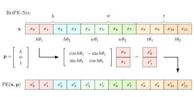

# RoPE-Nd
An efficient implementation of N-dimensional Rotary Position Embeddings for PyTorch.



## Example Use
e.g. for a video input:
```python3
import torch
from ropend import RoPENd

# (h, w, t, x)
pe = RoPENd((32, 32, 60, 240))
# (bs, h, w, t, x)
t = torch.randn(16, 32, 32, 60, 240) 
pe_t = pe(t)
print(pe_t.shape)
```
```
torch.Size([16, 32, 32, 60, 240])
```
Or single image:
```python3
pe = RoPENd((32, 32, 240))
t = torch.randn(16, 32, 32, 240) 
pe_t = pe(t)
```

Note that depending on the dimesion of the input, there are restricted lengths of `x` in order to divide it evenly:
- 1D: `x` is divisible by 2
- 2D: `x` is divisible by 4 (the second example)
- 3D: `x` is divisible by 6 (the first example)
- ...

## What is RoPE?
RoPE stands for Rotary Position Embedding.
It originates from [1], and is intended to be used as positional encoding in transformer architectures.
The issue is that the oringal authors designed it for NLP tasks, where data is typically one dimesional (e.g. the position within a list of tokens).
The technique used here, to generalise to multiple dimensions, is based on an approach taken in [2].
The idea is that pairs of adjacent features (forming a 2D vector) are rotated by a predictable angle.
The angle is based off the position of the feature vector with in the sequence.


### Example
Let's say you have a video sequence of shape `(24, 24, 300, 384)` (h, w, t, and feature vector).
The goal is to have each feature vector encoded with it's position within the sequence.
In this example, the features are paired up (192 pairs), and split into 3 groups (each with 64 pairs).
Each group corresponds a dimension (e.g. h, w or t).
64 angles are picked according to the following formula $\Theta = [10000^{-\frac{k}{64}}]_{k\in[64]}$.
The angles are then mutiplied by the position index.
For feature in position (15, 21, 217), the first group is element-wise rotated by $15\Theta$, the second by $21\Theta$ and the last by $217\Theta$.

The diagram at the top shows for a feature vecotor of length 12 and position (h, w, t).

## Sources
[1] RoFormer: Enhanced Transformer with Rotary Position Embedding
```bibtex
@misc{su2023roformer,
      title={RoFormer: Enhanced Transformer with Rotary Position Embedding}, 
      author={Jianlin Su and Yu Lu and Shengfeng Pan and Ahmed Murtadha and Bo Wen and Yunfeng Liu},
      year={2023},
      eprint={2104.09864},
      archivePrefix={arXiv},
      primaryClass={cs.CL}
}
```
[2] Act3D: 3D Feature Field Transformers for Multi-Task Robotic Manipulation
```bibtex
@misc{gervet2023act3d,
      title={Act3D: 3D Feature Field Transformers for Multi-Task Robotic Manipulation}, 
      author={Theophile Gervet and Zhou Xian and Nikolaos Gkanatsios and Katerina Fragkiadaki},
      year={2023},
      eprint={2306.17817},
      archivePrefix={arXiv},
      primaryClass={cs.RO}
}
```
Technique to use complex numbers: https://github.com/mistralai/mistral-src/blob/main/mistral/rope.py
